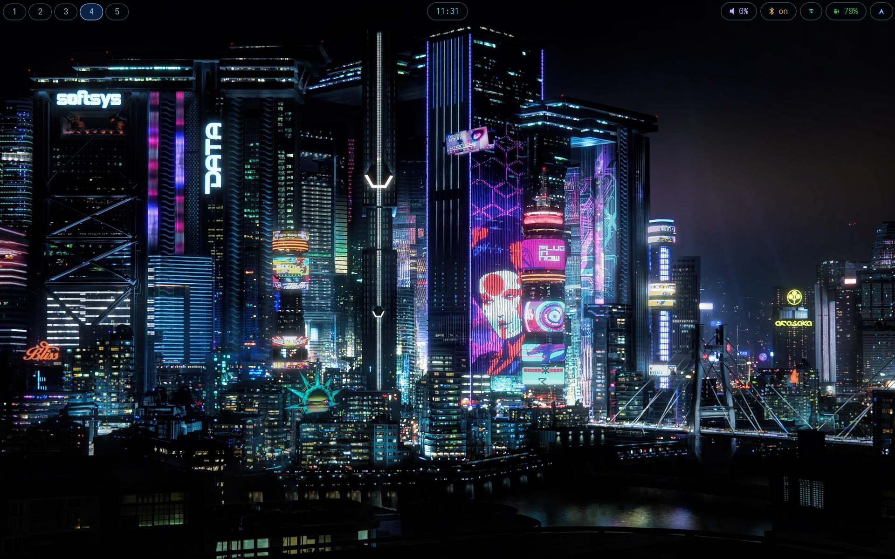
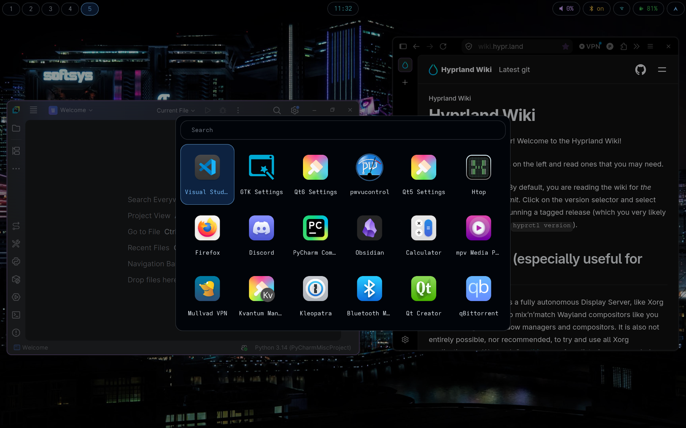
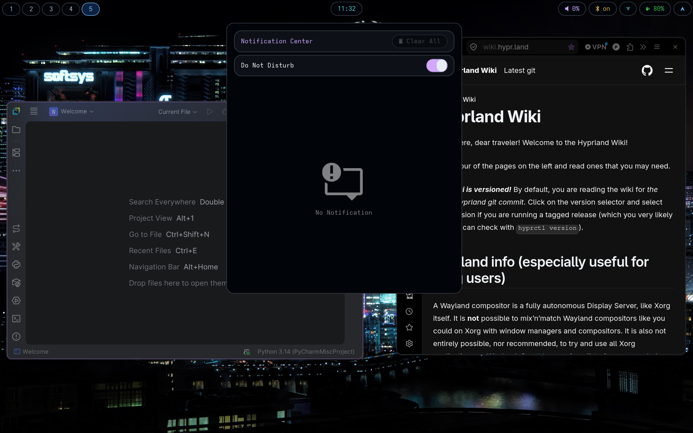
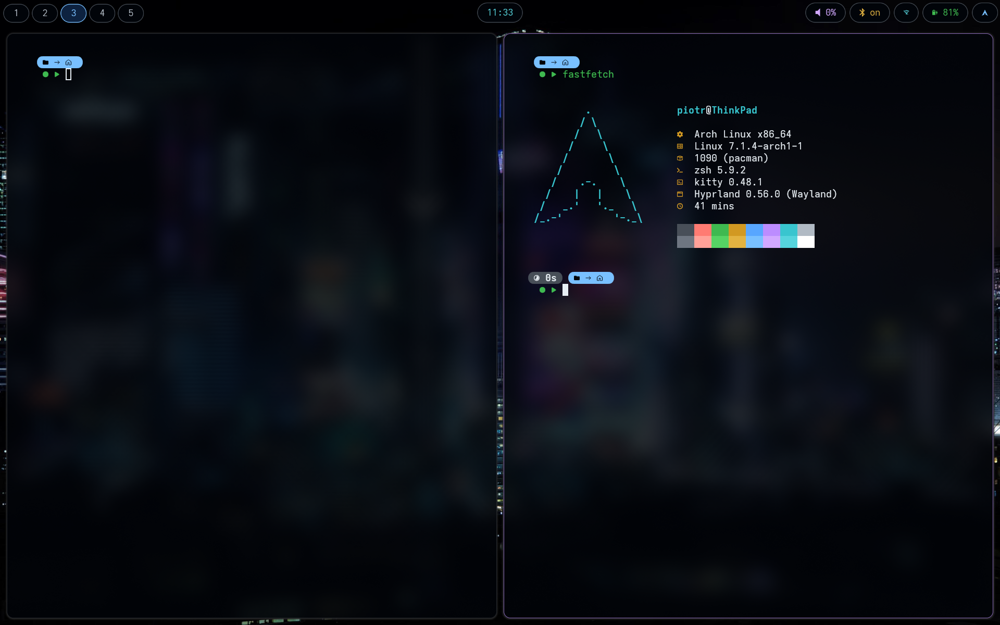
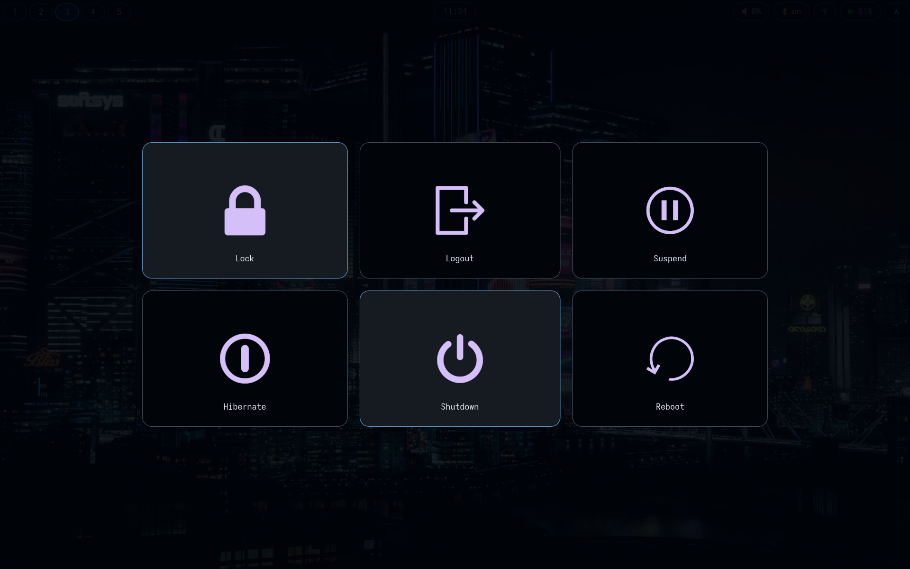

# dotfiles

Hyprland desktop on Arch, themed after **GitHub Dark**.

| | |
|---|---|
| Compositor | Hyprland (Lua config) |
| Bar | Waybar |
| Notifications | SwayNC |
| Launcher | Rofi |
| Terminal | kitty |
| Shell | zsh + starship |
| Lock / idle | hyprlock, hypridle |
| Logout | wlogout |
| Wallpaper | awww |
| GTK theme | Kripton |
| Qt style | Kvantum (Flight-Dark-Kvantum) via qt6ct |
| Icons | WhiteSur-dark |

## Screenshots



Bare desktop — waybar across the top: workspaces on the left, clock centred,
audio / bluetooth / network / battery / tray on the right.

| | |
|---|---|
|  |  |
| Rofi launcher, icon grid | SwayNC notification centre |
|  |  |
| kitty split, starship prompt, fastfetch | wlogout menu |

The wallpaper is not part of the repo — see [Wallpaper](#wallpaper).

## Install

Clone it wherever you like — the location is doesn't matter.

```sh
git clone <this repo> dotfiles
cd dotfiles
./install.sh --dry-run   # see what it would do
./install.sh
```

`install.sh` works out its own location at runtime, so `~/dotfiles`,
`~/.config/dotfiles`, `/what/ever/whatever` are all equally fine.

Everything is symlinked, so edits in the repo take effect immediately. The
script is re-runnable; anything already in the way is moved to
`~/.dotfiles-backup/<timestamp>/` rather than overwritten. It also creates
`~/Pictures/Screenshots`, since `grim` won't write into a directory that
doesn't exist.

If you **move the repo** after installing, the existing symlinks will dangle —
just re-run `./install.sh` from the new location and they get repointed (the
stale links are swept into the backup folder).

One thing worth editing straight away: `hypr/hyprconfig/monitors.lua` describes
my device's panel (`eDP-1`, 1920x1200, scale 1.25). Run `hyprctl monitors` for
your own output names. Anything not listed there falls back to a catch-all rule
at its preferred mode.

## Dependencies

```sh
pacman -S hyprland hyprlock hypridle hyprpolkitagent xdg-desktop-portal-hyprland \
          waybar swaync rofi kitty neovim starship fastfetch awww \
          zsh zsh-autosuggestions zsh-syntax-highlighting \
          pipewire wireplumber networkmanager nm-connection-editor \
          blueman nautilus libnotify \
          qt6ct kvantum nwg-look \
          adwaita-fonts adwaita-icon-theme adwaita-cursors \
          grim slurp wl-clipboard brightnessctl playerctl clang
```

`wlogout` and `pwvucontrol` are only on the AUR, so they need a helper:

```sh
yay -S wlogout pwvucontrol
```

A few things no package manager can provide:

- **The GTK, Qt and icon themes** — three third-party downloads, none of them
  in the repos and none of them committed here. See [Theming](#theming).
- **AdwaitaMono Nerd Font** — every config references it by name. Not in the
  repos; download it from [nerd-fonts](https://www.nerdfonts.com). Check [Fonts](https://wiki.archlinux.org/title/Fonts) if you don't know how to install it.
- **Wallpapers** — the desktop one is set by hand, see
  [Wallpaper](#wallpaper) below. The lockscreen one is a path in
  `hypr/hyprlock.conf`: `~/Pictures/Wallpapers/cyberpunk-city.jpeg`. Supply
  your own or edit the path.
- **Notification sound** — `swaync/notification-sound.sh` plays
  `swaync/notification.ogg`, which is not committed. Drop any ogg of that name
  next to the script to get a sound; without it notifications are silent and
  nothing breaks.

## Layout

```
colors/          shared GTK colour palette (waybar, swaync, wlogout)
fastfetch/       fastfetch config + arch ascii
hypr/            hyprland.lua + hyprconfig/*.lua, hyprlock, hypridle
hyprpolkitagent/ polkit dialog sizing
kitty/           kitty.conf + colour scheme
rofi/            launcher script, theme, colour scheme, shared imports
screenshots/     the images in the README
swaync/          notification centre config, style, sound script
waybar/          config.jsonc + one file per module, style, launch script
wlogout/         layout, style, icons + the svgs they came from
starship.toml    prompt
.zshrc           shell
```

## Theming

### Colours

`colors/palette.css` is the single source of truth for the GTK apps — waybar,
swaync and wlogout all `@import "../colors/palette.css"`. It is deployed to
`~/.config/colors`, which is why the relative paths resolve.

Non-GTK apps keep their own copy of the same palette in their own format:
`kitty/colors/colors.conf` and `rofi/colors/github-dark.rasi`.

### Widgets, icons and fonts

That palette only covers the things this repo draws itself. Ordinary
application windows — Nautilus, the qt6ct dialog, GTK file pickers — are themed
by three third-party themes that you have to install yourself:

| | | |
|---|---|---|
| GTK theme | Kripton | [EliverLara/Kripton](https://github.com/EliverLara/Kripton) → `~/.themes/` |
| Icons | WhiteSur-dark | [vinceliuice/WhiteSur-icon-theme](https://github.com/vinceliuice/WhiteSur-icon-theme) → `~/.icons/` |
| Qt style | Flight-Dark-Kvantum | [store.kde.org/p/2068657](https://store.kde.org/p/2068657) → `~/.config/Kvantum/` |

Kripton ships both a light and a dark stylesheet, so the dark variant has to be
asked for explicitly — `gtk-application-prefer-dark-theme=1` in the GTK3 and
GTK4 settings, and `color-scheme` set to `prefer-dark` in dconf:

```sh
gsettings set org.gnome.desktop.interface color-scheme 'prefer-dark'
```


Qt is routed through qt6ct — `env.lua` sets `QT_QPA_PLATFORMTHEME=qt6ct` — and
qt6ct's style is set to `kvantum`, which then picks up Flight-Dark-Kvantum from
`~/.config/Kvantum/kvantum.kvconfig`. `kvantummanager` and `qt6ct` are the GUIs
for both halves of that. qt6ct also carries its own icon-theme setting, set to
WhiteSur-dark to match GTK — it does not inherit the GTK one.

Qt5 is deliberately not set up. `QT_QPA_PLATFORMTHEME` is a single variable and
Qt5 and Qt6 read it looking for differently-named plugins, so it can only ever
satisfy one of them.

Fonts and cursor:

| | |
|---|---|
| UI font | Adwaita Sans 11 (`adwaita-fonts`) — GTK2/3/4 and qt6ct alike |
| Monospace | AdwaitaMono Nerd Font Mono 11 — qt6ct's fixed font; kitty sets its own in `kitty/kitty.conf`. GTK's own monospace is plain Adwaita Mono, with no Nerd glyphs |
| Cursor | Adwaita at size 20 (`adwaita-cursors`) — `env.lua` exports `XCURSOR_SIZE` and `HYPRCURSOR_SIZE` to match |

The GTK side of that table is written by `nwg-look`, which keeps GTK2, 3 and 4
in sync from one dialog.

None of the GTK or Qt settings files are in this repo, so `install.sh` does not
touch them. They are written by `nwg-look`, `qt6ct` and `kvantummanager`
respectively — reproducing this setup means installing the three themes above
and pointing those three tools at them.

## Wallpaper

No wallpaper is set anywhere in this repo. `autostart.lua` only starts
`awww-daemon`; you pick the image yourself:

```sh
awww img ~/Pictures/Wallpapers/whatever.jpeg
```

The daemon caches that choice per output in `~/.cache/awww/` and redisplays it
on the next login, so this survives reboots without anything being committed.
Until you run it the first time the desktop is black.

## Keybinds

`SUPER` is the modifier. Full list in `hypr/hyprconfig/binds.lua`.

| Bind | Action |
|---|---|
| `SUPER` + `RETURN` | Terminal |
| `SUPER` + `R` | Rofi |
| `SUPER` + `E` | Files |
| `SUPER` + `W` | Close window |
| `SUPER` + `V` | Toggle floating |
| `SUPER` + `Q` | Notification centre |
| `SUPER` + `T` | Restart bar + notifications |
| `SUPER` + `L` | Lock |
| `SUPER` + `N` | Logout menu |
| `SUPER` + `M` | Exit Hyprland |
| `SUPER` + arrows | Move focus |
| `SUPER` + `1..0` | Switch workspace |
| `SUPER` + `SHIFT` + `1..0` | Move window to workspace |
| `SUPER` + `S` | Scratchpad |
| `SUPER` + `SHIFT` + `S` | Move window to scratchpad |
| `PRINT` | Region screenshot → clipboard |
| `SUPER` + `PRINT` | Fullscreen → clipboard |
| `SUPER` + `SHIFT` + `PRINT` | Fullscreen → `~/Pictures/Screenshots` |

## Editing the Hyprland config

The config is Lua, not hyprlang. For completion on the `hl.*` API, point your
editor's Lua language server at the stubs Hyprland ships — in VS Code that is a
`hypr/.vscode/settings.json` containing:

```json
{ "Lua.workspace.library": [ "/usr/share/hypr/stubs" ] }
```

`hyprctl configerrors` reports problems in the running compositor.

## License

MIT, except the wlogout icons in `wlogout/assets` and `wlogout/icons` — those
are third-party and CC BY 3.0, attributed in `wlogout/assets/CREDIT.md`. See
[LICENSE](LICENSE).
